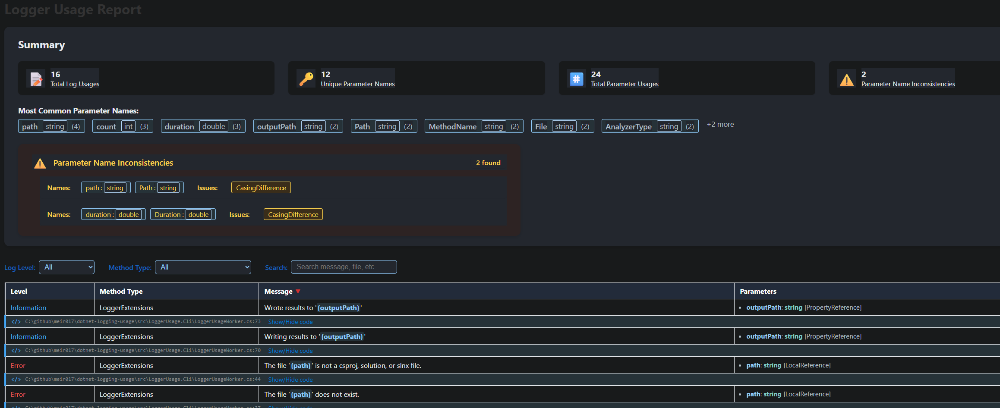
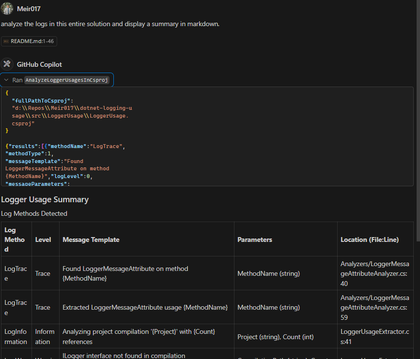

# dotnet-logging-tools

Create a summary of which log messages a project writes and the parameters to improve consistency

## Background

This tool analyzes .NET projects to extract and summarize logging usage patterns. It supports the following logging APIs:

### Supported Logging APIs

- **ILogger Extension Methods**: Analyzes usage of `LogInformation`, `LogWarning`, `LogError`, `LogDebug`, `LogTrace`, and `LogCritical` extension methods
- **[LoggerMessage Attribute](https://learn.microsoft.com/en-us/dotnet/core/extensions/logger-message-generator)**: Detects and analyzes methods decorated with `[LoggerMessage]` attribute for high-performance logging
- **[LoggerMessage.Define](https://learn.microsoft.com/en-us/dotnet/api/microsoft.extensions.logging.loggermessage)**: Analyzes usage of `LoggerMessage.Define` methods for compile-time log message generation
- **Structured Logging**: Captures parameter names and templates used in structured logging scenarios

The tool helps identify:

- Inconsistent parameter naming across log messages
- Most commonly used log parameters
- Log level distribution across your codebase
- Template patterns and message structures

## Usage

### CLI

create HTML/JSON report:

```bash
dotnet run --project src/LoggerUsage.Cli -- <path-to-your-sln-or-csproj> <output-file-name>.<html/json>
```

Example report:

run the command:
```bash
dotnet run --project src/LoggerUsage.Cli -- src/LoggerUsage.Cli/LoggerUsage.Cli.csproj report.html
```


and in dark mode:



## Running the MCP Server Locally

To run the MCP server locally:

```bash
dotnet run --project src/LoggerUsage.Mcp
```

By default, the server will use the configuration in `src/LoggerUsage.Mcp/appsettings.json`. You can modify this file to adjust server settings as needed.



## Roadmap

- [ ] Add support for `ILogger.Log` method
- [ ] Add support for `ILogger.BeginScope` method
- [ ] Create a summary of the log messages
- [ ] Integrate AI to suggest improvements and find inconsistencies
- [ ] For LoggerMessageAttribute - find all invocations of method
- [x] Expose as a MCP
