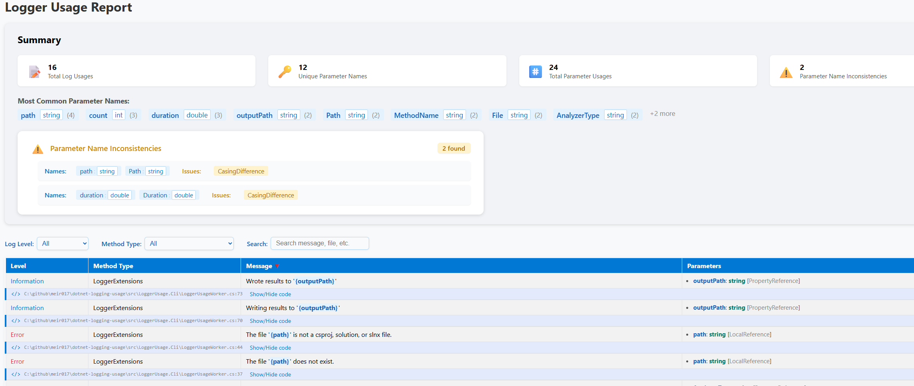

# dotnet-logging-tools

> *This library is mostly vibe coded using github-copilot with the Claude Sonnet 4 model in agent mode*

Create a summary of which log messages a project writes and the parameters to improve consistency

[](https://www.nuget.org/packages/LoggerUsage) [](https://www.nuget.org/packages/LoggerUsage) - Core library for analyzing .NET logging usage patterns

[](https://www.nuget.org/packages/LoggerUsage.Cli) [](https://www.nuget.org/packages/LoggerUsage.Cli) - Command-line tool for generating HTML/JSON reports

[](https://www.nuget.org/packages/LoggerUsage.Mcp) [](https://www.nuget.org/packages/LoggerUsage.Mcp) - Model Context Protocol server for AI integrations

[](https://www.nuget.org/packages/LoggerUsage.MSBuild) [](https://www.nuget.org/packages/LoggerUsage.MSBuild) - MSBuild integration for workspace analysis

## Background

This tool analyzes .NET projects to extract and summarize logging usage patterns. It supports the following logging APIs:

### Supported Logging APIs

- **ILogger Extension Methods**: Analyzes usage of `LogInformation`, `LogWarning`, `LogError`, `LogDebug`, `LogTrace`, and `LogCritical` extension methods
- **[LoggerMessage Attribute](https://learn.microsoft.com/en-us/dotnet/core/extensions/logger-message-generator)**: Detects and analyzes methods decorated with `[LoggerMessage]` attribute for high-performance logging
- **[LoggerMessage.Define](https://learn.microsoft.com/en-us/dotnet/api/microsoft.extensions.logging.loggermessage)**: Analyzes usage of `LoggerMessage.Define` methods for compile-time log message generation
- **Structured Logging**: Captures parameter names and templates used in structured logging scenarios

The tool helps identify:

- Inconsistent parameter naming across log messages
- Most commonly used log parameters
- Log level distribution across your codebase
- Template patterns and message structures

### Advanced Telemetry Features

The tool also provides advanced telemetry analysis capabilities:

- **Custom Tag Names**: Detects and tracks custom tag names defined via `[TagName]` attribute for enhanced structured logging
- **Tag Providers**: Analyzes tag providers using `[TagProvider]` attribute for dynamic tag generation and validates their configuration
- **Data Classification**: Identifies data classification attributes (Public, Internal, Private, Sensitive) for compliance and redaction analysis
- **Transitive Properties**: Analyzes nested properties when using `[LogProperties(Transitive = true)]` to track deep object hierarchies

These features enable:
- Better observability through standardized tag naming
- Compliance validation for sensitive data logging
- Understanding of nested property structures in logs
- Identification of tag provider validation issues

## Usage

### CLI

create HTML/JSON report:

```bash
dotnet run --project src/LoggerUsage.Cli -- <path-to-your-sln-or-csproj> <output-file-name>.<html/json>
```

Example report:

run the command:
```bash
dotnet run --project src/LoggerUsage.Cli -- src/LoggerUsage.Cli/LoggerUsage.Cli.csproj report.html
```



and in dark mode:


### Report Features

The generated reports include:

**Summary Statistics:**
- Total log usages and parameter counts
- Classification breakdown (Public, Internal, Private, Sensitive)
- Telemetry features usage (custom tag names, tag providers, transitive properties)
- Parameter name inconsistencies

**Detailed Analysis:**
- Individual log usage details with file locations
- Custom tag name mappings
- Tag provider configurations and validation status
- Nested property hierarchies for transitive analysis
- Data classification annotations

**Output Formats:**
- **HTML**: Interactive report with collapsible sections, dark mode support, and filtering capabilities
- **JSON**: Structured data with schema version 2.0 for programmatic analysis
- **Markdown**: Human-readable report suitable for documentation

## Running the MCP Server Locally

To run the MCP server locally:

```bash
dotnet run --project src/LoggerUsage.Mcp
```

By default, the server will use the configuration in `src/LoggerUsage.Mcp/appsettings.json`. You can modify this file to adjust server settings as needed.


## Roadmap

- [ ] Add support for `ILogger.Log` method
- [x] Add support for `ILogger.BeginScope` method
- [ ] Create a summary of the log messages
- [ ] Integrate AI to suggest improvements and find inconsistencies
- [x] For LoggerMessageAttribute - find all invocations of method (see [implementation plan](LoggerMessageAttribute-Invocations-Plan.md))
- [x] Expose as a MCP
