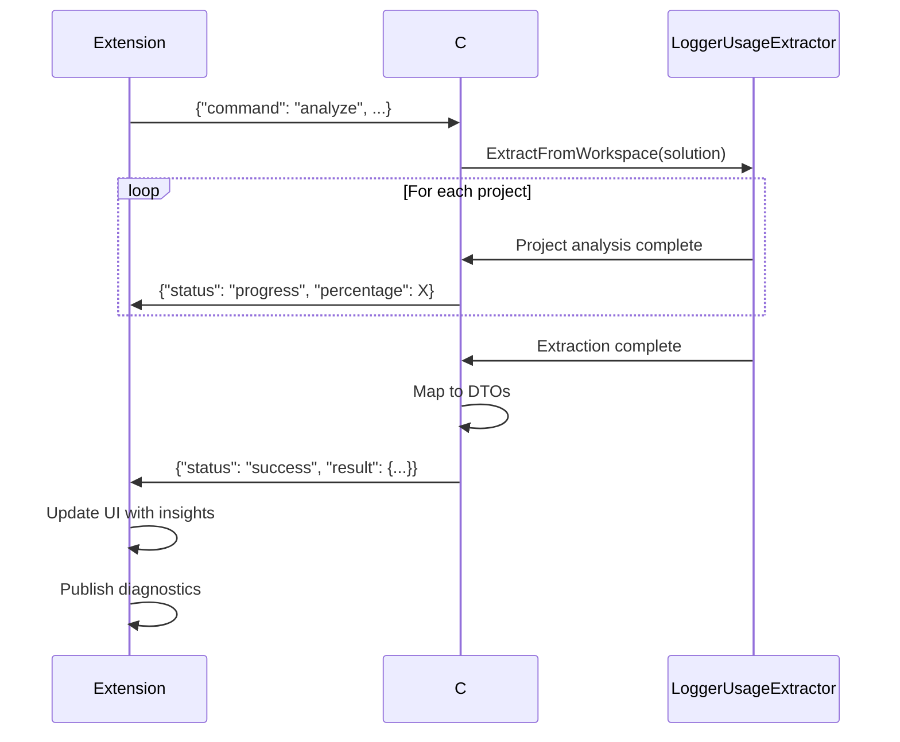

# Contract: Analysis Service (TypeScript ↔ C# Bridge)

**Feature**: VS Code Logging Insights Extension
**Component**: Analysis Service & Bridge Process
**Purpose**: Define IPC protocol and behavior between TypeScript extension and C# bridge

---

## Bridge Process Lifecycle

### Initialization

**When**: Extension activates or first analysis requested

**Process**:
1. Extension locates bridge executable:
   - Bundled: `{extensionPath}/bin/{platform}/LoggerUsage.VSCode.Bridge.exe`
   - User-installed .NET: `dotnet {extensionPath}/bridge/LoggerUsage.VSCode.Bridge.dll`
2. Spawns child process via `child_process.spawn()`
3. Establishes stdin/stdout pipes
4. Sends handshake message to verify bridge is responsive

**Handshake Protocol**:
```json
Request:  {"command": "ping"}
Response: {"status": "ready", "version": "1.0.0"}
```

**Timeout**: 10 seconds for handshake, else consider bridge failed

---

### Termination

**When**: Extension deactivates, workspace closes, or analysis cancelled

**Process**:
1. Send graceful shutdown signal: `{"command": "shutdown"}`
2. Wait up to 5 seconds for bridge process to exit cleanly
3. If still running, send SIGTERM (Unix) or taskkill (Windows)
4. Dispose stdio streams

---

## Analysis Request Protocol

### Full Workspace Analysis

**Initiated by**: Extension on activation, manual refresh, or solution change

**Request**:
```json
{
  "command": "analyze",
  "workspacePath": "D:\\Projects\\MyApp",
  "solutionPath": "D:\\Projects\\MyApp\\MyApp.sln",
  "excludePatterns": ["**/obj/**", "**/bin/**"]
}
```

**Response Sequence**:
1. **Progress Updates** (0 or more):
   ```json
   {
     "status": "progress",
     "percentage": 45,
     "message": "Analyzing project MyApp.Core",
     "currentFile": "D:\\Projects\\MyApp\\MyApp.Core\\Services\\LoggingService.cs"
   }
   ```

2. **Success Response**:
   ```json
   {
     "status": "success",
     "result": {
       "insights": [ /* array of LoggingInsightDto */ ],
       "summary": {
         "totalInsights": 142,
         "byMethodType": { "LoggerExtension": 80, "LoggerMessageAttribute": 62 },
         "byLogLevel": { "Information": 50, "Warning": 30, "Error": 20 },
         "inconsistenciesCount": 5,
         "filesAnalyzed": 87,
         "analysisTimeMs": 3421
       }
     }
   }
   ```

3. **Error Response** (on failure):
   ```json
   {
     "status": "error",
     "message": "Failed to load solution",
     "details": "The solution file could not be parsed: ...",
     "errorCode": "SOLUTION_LOAD_FAILED"
   }
   ```

---

### Incremental File Analysis

**Initiated by**: Extension when user saves a C# file (if `autoAnalyzeOnSave: true`)

**Request**:
```json
{
  "command": "analyzeFile",
  "filePath": "D:\\Projects\\MyApp\\MyApp.Core\\Services\\LoggingService.cs",
  "solutionPath": "D:\\Projects\\MyApp\\MyApp.sln"
}
```

**Response**: Same structure as full analysis, but `result.insights` contains only insights from the specified file

**Performance Target**: < 2 seconds for typical file (< 500 LOC)

---

## Error Codes

| Code | Meaning | Recovery Action |
|------|---------|----------------|
| `SOLUTION_LOAD_FAILED` | Solution file invalid or missing | Prompt user to select different solution |
| `COMPILATION_FAILED` | Roslyn compilation errors | Show warning, continue with partial results |
| `TIMEOUT` | Analysis exceeded time limit | Offer to cancel or continue |
| `OUT_OF_MEMORY` | Bridge process ran out of memory | Suggest reducing `maxFilesPerAnalysis` |
| `DOTNET_RUNTIME_ERROR` | .NET runtime issue | Check .NET installation |
| `UNKNOWN_COMMAND` | Invalid command sent to bridge | Internal error, log and retry |

---

## Cancellation Protocol

**Initiated by**: User clicks "Cancel" during analysis, or `CancellationToken` triggered

**Process**:
1. Extension sends cancellation message:
   ```json
   {"command": "cancel"}
   ```
2. Bridge stops current analysis gracefully:
   - Completes current file (doesn't interrupt mid-file)
   - Returns partial results
3. Bridge responds:
   ```json
   {
     "status": "cancelled",
     "result": { /* partial results */ },
     "message": "Analysis cancelled by user"
   }
   ```

---

## Progress Reporting Requirements

**Frequency**: Bridge must send progress updates at least every 5 seconds during long-running analysis

**Granularity**:
- **Percentage**: 0-100, updated per-file or per-project
- **Message**: Human-readable (e.g., "Analyzing project Foo", "Analyzing file Bar.cs")
- **CurrentFile**: Absolute path to file being analyzed (optional, for detailed progress)

**Extension Behavior**:
- Displays progress in VS Code notification with progress bar
- Shows cancellation button in notification
- Updates status bar with percentage

---

## Performance Contracts

### Analysis Speed

- **Small solution** (< 100 files): < 5 seconds
- **Medium solution** (100-500 files): < 30 seconds
- **Large solution** (500-2000 files): < 2 minutes
- **Very large solution** (> 2000 files): Best-effort with progress feedback

### Memory Usage

- Bridge process should not exceed **1 GB** for typical solutions
- If exceeds 1.5 GB, log warning and suggest configuration adjustment
- Dispose Roslyn compilations after each project to minimize memory

### Incremental Analysis

- Single file re-analysis: **< 2 seconds** (excludes initial compilation load)
- Leverages cached Roslyn compilation when possible

---

## Concurrency & State Management

### Single Analysis at a Time

**Rule**: Only one analysis operation per bridge process

**Behavior**:
- If new analysis requested while one in progress: queue request, cancel current
- Extension shows notification: "Restarting analysis with updated files..."

### Bridge Process Reuse

**Rule**: Bridge process remains running between analyses for performance

**Behavior**:
- First analysis: ~5 seconds overhead (Roslyn initialization)
- Subsequent analyses: ~1 second overhead (reusing loaded assemblies)

**Exception**: If bridge process crashes or becomes unresponsive, spawn new instance

---

## Data Validation

### Extension → Bridge

**Validation**:
- `workspacePath` and `solutionPath` are absolute paths
- `excludePatterns` are valid glob patterns (no shell injection risk)
- All paths are within workspace boundaries (security)

**On Validation Failure**:
- Extension logs error, does not send to bridge
- Shows user-friendly error notification

### Bridge → Extension

**Validation**:
- JSON schema validation on responses
- `insights` array contains valid `LoggingInsightDto` objects
- File paths in responses are absolute and exist
- Percentages in progress updates are 0-100

**On Validation Failure**:
- Extension logs warning, ignores malformed message
- Continues listening for next message

---

## Testing Scenarios

### Happy Path

1. Send `analyze` request → receive progress updates → receive success response
2. Results displayed in UI, no errors

### Error Scenarios

1. **Invalid solution path**: Error response with `SOLUTION_LOAD_FAILED`
2. **Compilation errors in code**: Success response with warnings, partial results
3. **Bridge crash mid-analysis**: Extension detects bridge exit, shows error, allows retry
4. **Timeout**: Progress stalls for > 60 seconds, extension shows timeout warning

### Cancellation

1. User cancels during analysis → bridge stops gracefully → partial results returned
2. User cancels before first progress update → bridge returns empty results

### Performance

1. **Large solution**: Progress updates every few seconds, total time < 5 minutes
2. **Incremental update**: File saved → analysis completes < 2 seconds → UI updates

---

## Sequence Diagram: Full Analysis



---

## Security Considerations

1. **Path Traversal**: Validate all paths from extension before sending to bridge
2. **Command Injection**: No shell commands executed by bridge (only Roslyn API)
3. **Resource Limits**: Bridge enforces memory/time limits to prevent DoS
4. **Process Isolation**: Bridge runs as separate process, sandboxed from extension

---

**Contract Owner**: `AnalysisService` (TypeScript) & `BridgeProgram` (C#)
**Dependencies**: `LoggerUsageExtractor`, stdio streams, JSON serialization
**Validation**: Integration tests with mock bridge, E2E tests with real solutions
