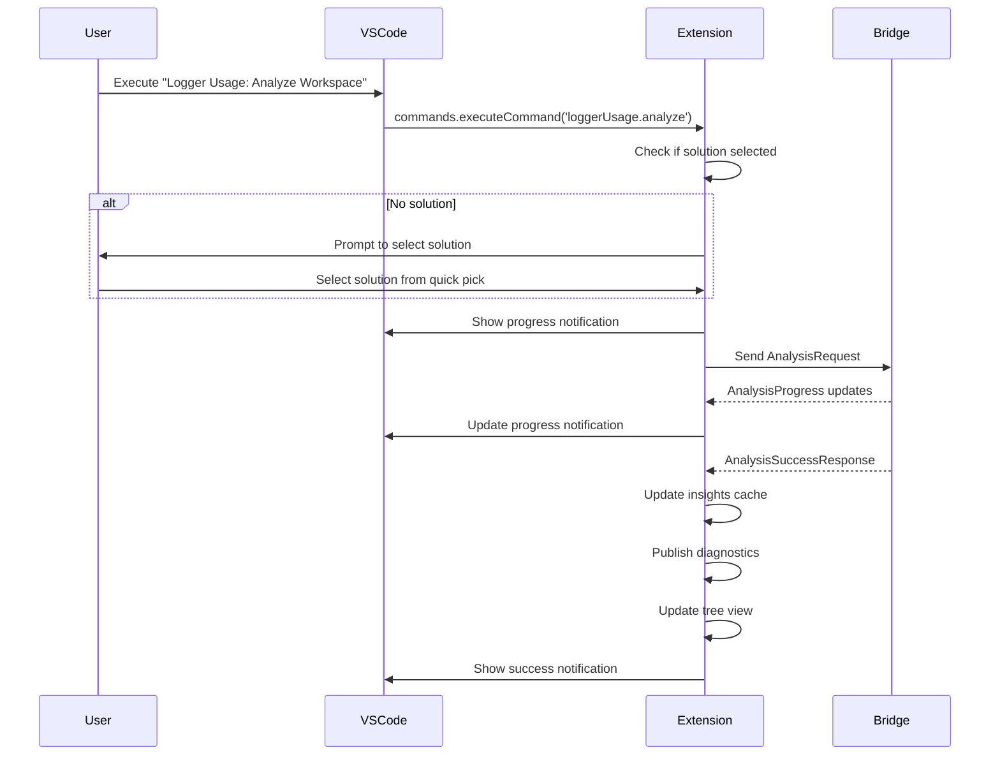

# Contract: Commands

**Feature**: VS Code Logging Insights Extension
**Component**: Command Palette & Keybindings
**Purpose**: Define all commands exposed by the extension

---

## Command Registration

### Extension Activation

**When**: Extension activates

**Process**:
```typescript
export function activate(context: vscode.ExtensionContext) {
  context.subscriptions.push(
    vscode.commands.registerCommand('loggerUsage.analyze', analyzeCommand),
    vscode.commands.registerCommand('loggerUsage.showInsightsPanel', showInsightsPanelCommand),
    vscode.commands.registerCommand('loggerUsage.selectSolution', selectSolutionCommand),
    // ... other commands
  );
}
```

**All Commands**: Listed in `package.json` under `contributes.commands`

---

## Core Commands

### 1. `loggerUsage.analyze`

**Title**: "Logger Usage: Analyze Workspace"

**Description**: Triggers full analysis of active solution

**Keybinding**: `Ctrl+Shift+L` (Windows/Linux), `Cmd+Shift+L` (Mac)

**Preconditions**:
- Workspace is open
- At least one solution or C# project detected

**Behavior**:
1. If no active solution, prompts user to select one
2. Shows progress notification with cancel button
3. Sends analysis request to bridge
4. Updates insights panel and Problems panel on completion
5. Shows summary notification: "Analysis complete: 142 insights found"

**Postconditions**:
- Insights cached in extension memory
- Tree view updated
- Diagnostics published

**Error Handling**:
- If bridge fails: Shows error notification with "Retry" action
- If timeout: Shows warning with "Cancel" and "Continue" actions

---

### 2. `loggerUsage.showInsightsPanel`

**Title**: "Logger Usage: Show Insights Panel"

**Description**: Opens or focuses the logging insights webview panel

**Keybinding**: None (can be user-configured)

**Preconditions**: None

**Behavior**:
1. If panel already open: Brings to foreground
2. If panel disposed: Creates new panel, loads HTML
3. Sends current insights/filters to webview
4. If no insights: Shows "Run analysis to see results" message

**Postconditions**:
- Webview panel visible in editor group

---

### 3. `loggerUsage.selectSolution`

**Title**: "Logger Usage: Select Solution"

**Description**: Allows user to manually select solution file

**Keybinding**: None

**Preconditions**: Workspace is open

**Behavior**:
1. Scans workspace for `.sln` files
2. Shows quick pick with solution options:
   - "MyApp.sln (D:\\Projects\\MyApp)"
   - "OtherApp.sln (D:\\Projects\\OtherApp)"
   - "Browse for solution file..."
3. If "Browse": Opens file picker filtered to `.sln` files
4. Sets selected solution as active
5. Updates status bar
6. Triggers automatic analysis (if `autoAnalyzeOnSave: true`)

**Postconditions**:
- Active solution changed
- Stored in workspace state

---

### 4. `loggerUsage.exportInsights`

**Title**: "Logger Usage: Export Insights"

**Description**: Exports current insights to file

**Keybinding**: None

**Preconditions**: Insights are available (analysis has run)

**Behavior**:
1. Shows quick pick for format:
   - "Markdown (*.md)"
   - "JSON (*.json)"
   - "CSV (*.csv)"
2. Opens save file dialog with default filename: `logging-insights-{date}.{ext}`
3. Generates report using `LoggerUsageMarkdownReportGenerator` (or JSON/CSV serializer)
4. Writes to selected file
5. Shows success notification: "Insights exported to {file}" with "Open File" action

**Postconditions**:
- File created at user-selected location

---

### 5. `loggerUsage.clearFilters`

**Title**: "Logger Usage: Clear Filters"

**Description**: Resets all filters in insights panel to defaults

**Keybinding**: `Ctrl+Shift+R` (in webview context)

**Preconditions**: Insights panel is open

**Behavior**:
1. Resets `FilterState` to default values (from configuration)
2. Sends `updateFilters` message to webview
3. Webview updates UI and displays all insights

**Postconditions**:
- All filters cleared
- Full insight list displayed

---

### 6. `loggerUsage.navigateToInsight`

**Title**: (Internal command, not shown in palette)

**Description**: Navigates editor to specific logging insight location

**Arguments**: `{ insightId: string }`

**Preconditions**: Insight ID is valid

**Behavior**:
1. Parses `insightId` to extract file path, line, column
2. Opens file: `vscode.window.showTextDocument(uri, { selection: range })`
3. Highlights the logging statement line
4. Brings editor to foreground

**Postconditions**:
- Editor focused on insight location

---

### 7. `loggerUsage.refreshTreeView`

**Title**: "Logger Usage: Refresh Tree View"

**Description**: Reloads tree view data (without re-analyzing)

**Keybinding**: None (available in tree view context menu)

**Preconditions**: None

**Behavior**:
1. Triggers `TreeDataProvider.refresh()` event
2. Tree view re-queries data
3. Collapses/expands state preserved

**Postconditions**:
- Tree view updated with current insights

---

## Context Menu Commands

### 8. `loggerUsage.navigateToInsightFromTree`

**Title**: "Go to Insight"

**Context**: Tree view item context menu (when item type is `insight`)

**Behavior**:
- Same as `loggerUsage.navigateToInsight`
- Extracts insight ID from tree item
- Opens file and navigates to location

---

### 9. `loggerUsage.exportInsightsToCsv`

**Title**: "Export to CSV"

**Context**: Tree view item context menu (on solution/project node)

**Behavior**:
- Filters insights to selected solution/project
- Exports to CSV format
- Prompts for save location

---

## Configuration-Based Commands

### 10. `loggerUsage.toggleAutoAnalyze`

**Title**: "Logger Usage: Toggle Auto-Analyze on Save"

**Description**: Toggles `autoAnalyzeOnSave` setting

**Behavior**:
1. Reads current `autoAnalyzeOnSave` value
2. Inverts it: `true` → `false` or `false` → `true`
3. Updates configuration: `vscode.workspace.getConfiguration('loggerUsage').update('autoAnalyzeOnSave', newValue)`
4. Shows notification: "Auto-analyze on save: {enabled/disabled}"

**Postconditions**:
- Configuration updated
- File save watcher behavior changes accordingly

---

## Diagnostic Commands

### 11. `loggerUsage.showDiagnosticDetails`

**Title**: (Internal command triggered by diagnostic code action)

**Description**: Shows detailed explanation for a diagnostic

**Arguments**: `{ diagnosticCode: string }`

**Behavior**:
1. Opens webview panel with diagnostic documentation
2. Shows explanation, examples, and fix suggestions for the diagnostic code
3. Provides "Learn More" link to documentation

**Example**:
- Diagnostic code: `PARAM_INCONSISTENCY`
- Panel shows: "Parameter Name Inconsistency: Explanation, Examples, How to Fix"

---

## Keybindings

### Default Keybindings (package.json)

```json
{
  "contributes": {
    "keybindings": [
      {
        "command": "loggerUsage.analyze",
        "key": "ctrl+shift+l",
        "mac": "cmd+shift+l",
        "when": "editorLangId == csharp"
      },
      {
        "command": "loggerUsage.clearFilters",
        "key": "ctrl+shift+r",
        "mac": "cmd+shift+r",
        "when": "loggerUsageWebviewFocused"
      }
    ]
  }
}
```

**Context Keys**:
- `editorLangId == csharp`: Keybinding active only in C# files
- `loggerUsageWebviewFocused`: Custom context set when insights panel has focus

---

## Command Palette Organization

### Command Titles

All command titles prefixed with `Logger Usage:` for easy discovery

**Examples**:
- "Logger Usage: Analyze Workspace"
- "Logger Usage: Show Insights Panel"
- "Logger Usage: Select Solution"

### Command Categories (package.json)

```json
{
  "contributes": {
    "commands": [
      {
        "command": "loggerUsage.analyze",
        "title": "Analyze Workspace",
        "category": "Logger Usage",
        "icon": "$(search)"
      },
      {
        "command": "loggerUsage.showInsightsPanel",
        "title": "Show Insights Panel",
        "category": "Logger Usage",
        "icon": "$(list-tree)"
      }
    ]
  }
}
```

---

## Command Availability (When Clauses)

### Solution-Dependent Commands

**Commands**: `loggerUsage.analyze`, `loggerUsage.exportInsights`

**Availability**:
```json
{
  "when": "loggerUsage.hasSolution"
}
```

**Context Key**: `loggerUsage.hasSolution` set by extension when solution detected

---

### Insights-Dependent Commands

**Commands**: `loggerUsage.exportInsights`, `loggerUsage.clearFilters`

**Availability**:
```json
{
  "when": "loggerUsage.hasInsights"
}
```

**Context Key**: `loggerUsage.hasInsights` set after successful analysis

---

## Command Aliases

### `loggerUsage.analyzeCurrentFile`

**Title**: "Logger Usage: Analyze Current File"

**Description**: Analyzes only the currently open C# file (incremental)

**Keybinding**: `Ctrl+Shift+Alt+L`

**Behavior**:
- If current file not in active solution: Shows warning
- Otherwise: Triggers incremental analysis for that file only
- Updates insights panel and diagnostics for that file

---

## Error Handling

### Command Execution Failure

**Scenario**: Command throws exception during execution

**Behavior**:
1. Extension catches exception
2. Logs error to output channel: "Logger Usage"
3. Shows error notification: "Command failed: {error message}"
4. Provides "Show Logs" action to open output channel

---

### Command Unavailable

**Scenario**: User invokes command when preconditions not met

**Behavior**:
- VS Code grays out command in palette (via `when` clause)
- If invoked programmatically (e.g., via keybinding), shows info notification: "No solution detected. Open a workspace with a .NET solution first."

---

## Testing Scenarios

### Happy Path

1. Execute `loggerUsage.analyze` → analysis runs → insights displayed
2. Execute `loggerUsage.showInsightsPanel` → panel opens with results

### Edge Cases

1. Execute `loggerUsage.analyze` with no solution → prompts to select solution
2. Execute `loggerUsage.exportInsights` before analysis → shows "No insights to export"
3. Execute `loggerUsage.selectSolution` in empty workspace → shows "No solutions found"

### Keybindings

1. Press `Ctrl+Shift+L` in C# file → analysis triggered
2. Press `Ctrl+Shift+L` in non-C# file → command not triggered

---

## Command Documentation

### Help Command

**Command**: `loggerUsage.showHelp`

**Title**: "Logger Usage: Show Help"

**Behavior**:
- Opens webview with getting started guide
- Shows list of available commands with descriptions
- Links to GitHub repository and documentation

---

## Sequence Diagram: Analyze Command



---

**Contract Owner**: `CommandRegistry` (TypeScript)
**Dependencies**: VS Code Commands API, Analysis Service, Insights Panel, Tree View
**Validation**: Command execution tests, keybinding tests, context availability tests
