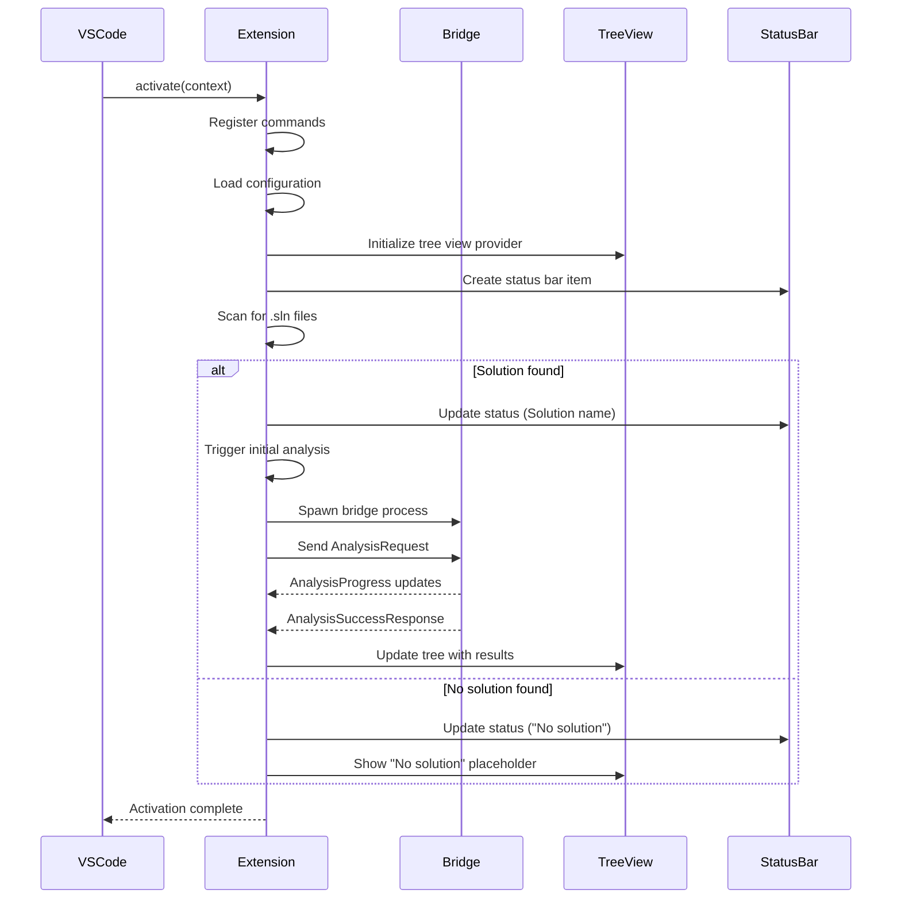

# Contract: Extension Activation

**Feature**: VS Code Logging Insights Extension
**Component**: Extension Host
**Purpose**: Define when and how the extension activates

---

## Activation Events

### 1. Workspace Contains Solution File

**Trigger**: `workspaceContains:**/*.sln`

**Behavior**:
- Extension activates when VS Code workspace contains any `.sln` file
- Scans workspace folders for `.sln` files on activation
- If multiple solutions found, selects first one as active by default

**Preconditions**:
- VS Code workspace is open
- At least one folder in workspace

**Postconditions**:
- Extension status bar item appears
- Solution selector command is registered
- Tree view provider is initialized (may show "No solution selected" state)

---

### 2. Workspace Contains C# Project File

**Trigger**: `workspaceContains:**/*.csproj`

**Behavior**:
- Extension activates when workspace contains `.csproj` files
- Attempts to infer solution structure from project references
- If no `.sln` found, operates in "project-only" mode

**Preconditions**:
- VS Code workspace is open
- No `.sln` files present, but at least one `.csproj` file exists

**Postconditions**:
- Extension status bar shows "Projects (no solution)"
- Analysis can proceed on individual projects
- Tree view displays project-level hierarchy

---

### 3. Explicit Activation Command

**Trigger**: User executes `loggerUsage.activate` command

**Behavior**:
- Extension activates even if no solution/project detected
- Allows user to manually select solution file
- Useful for non-standard workspace layouts

**Preconditions**:
- VS Code workspace is open
- Extension is installed

**Postconditions**:
- File picker dialog opens for solution selection
- Selected solution becomes active
- Analysis begins

---

## Activation Sequence

---

## Deactivation Sequence

**Trigger**: Extension deactivates (workspace close, VS Code exit, extension uninstall)

**Behavior**:
1. Cancel any in-progress analysis (send cancellation to bridge)
2. Terminate bridge process gracefully
3. Dispose tree view provider
4. Clear diagnostic collection (remove Problems panel entries)
5. Dispose status bar item
6. Clear cached analysis results

**Timeout**: 5 seconds for graceful shutdown, then force-kill bridge process

---

## Edge Cases

### Multiple Workspaces

**Scenario**: VS Code has multiple workspace folders, each with own solution

**Behavior**:
- Extension activates once (shared across workspaces)
- Tracks active solution per workspace folder
- Status bar shows active solution for currently focused editor
- Tree view filters to active workspace folder's solution

### Solution File Changes

**Scenario**: User adds/removes/renames `.sln` file while extension active

**Behavior**:
- File watcher detects `.sln` changes
- Re-scans workspace for solutions
- If active solution removed, prompts user to select new one
- If new solution added, shows notification with option to switch

### Extension Upgrade

**Scenario**: User upgrades extension while VS Code running

**Behavior**:
- VS Code reloads extension automatically
- Re-runs activation sequence
- Preserves active solution selection (stored in workspace state)
- Re-analyzes solution if analysis was complete before upgrade

---

## Configuration Impact on Activation

### `autoAnalyzeOnSave: false`

**Impact**:
- Extension still activates normally
- No automatic analysis on activation
- User must manually trigger via command: `loggerUsage.analyze`

### `excludePatterns` Configuration

**Impact**:
- Applied during activation if automatic analysis enabled
- Passed to bridge in `AnalysisRequest`

---

## Performance Considerations

- Activation should complete within **2 seconds** for typical workspaces
- Solution scanning uses efficient file system APIs (no full read)
- Bridge process spawn deferred until first analysis requested (if `autoAnalyzeOnSave: false`)

---

## Error Handling

### Bridge Process Fails to Start

**Behavior**:
- Show error notification: "Failed to start analysis bridge. Check .NET runtime is installed."
- Extension remains active but analysis unavailable
- Status bar shows error icon
- Retry available via command

### Invalid Solution File

**Behavior**:
- Show warning notification: "Invalid solution file: {file}. Select different solution."
- Extension remains active
- Prompts user to select valid solution

### No .NET Runtime Detected

**Behavior**:
- If bundled runtime missing or corrupt: "Extension installation corrupt. Reinstall extension."
- If requiring user-installed .NET: "No .NET runtime found. Install .NET 10 SDK or runtime."
- Provides "Download .NET" button in notification

---

## Testing Scenarios

1. **Fresh activation with solution**: Extension activates, analyzes, shows results
2. **Activation with no solution**: Extension activates, shows placeholder
3. **Multiple solutions**: User can select between solutions
4. **Large solution (1000+ files)**: Activation completes quickly, analysis runs in background
5. **Bridge failure**: Error handled gracefully, user can retry
6. **Workspace close**: Extension cleans up resources properly
7. **Configuration change during activation**: New config applied before analysis

---

**Contract Owner**: Extension Host (`src/LoggerUsage.VSCode/extension.ts`)
**Dependencies**: VS Code Extension API, Bridge Process, Configuration Service
**Validation**: Extension activation tests, integration tests
