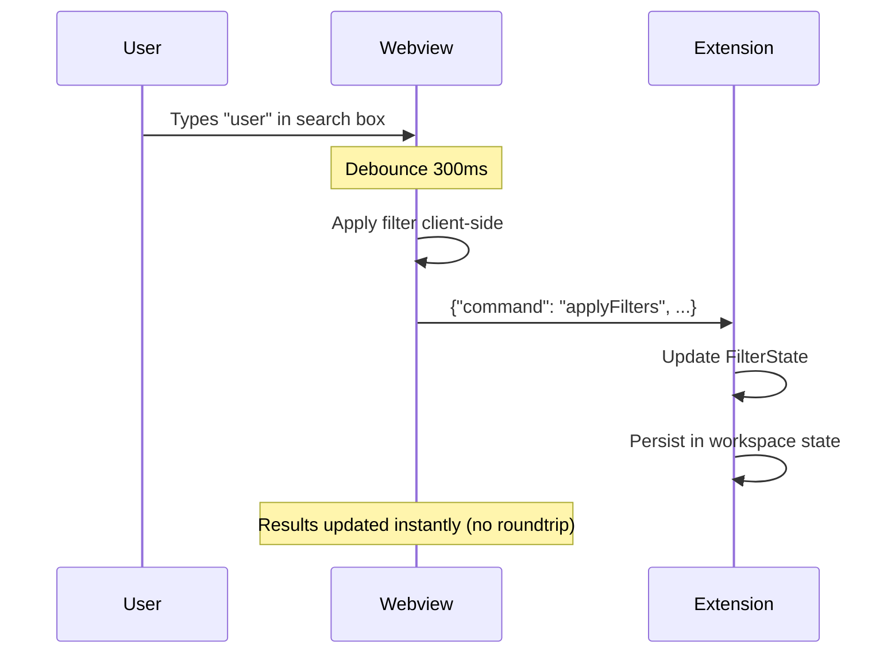

# Contract: Insights Panel (Webview)

**Feature**: VS Code Logging Insights Extension
**Component**: Insights Panel Webview
**Purpose**: Define webview behavior, message passing, and UI interactions

---

## Webview Initialization

### Creation

**When**: User executes `loggerUsage.showInsightsPanel` command, or automatically after analysis completes

**Process**:
1. Extension creates webview panel:
   ```typescript
   const panel = vscode.window.createWebviewPanel(
     'loggerUsageInsights',      // viewType
     'Logging Insights',          // title
     vscode.ViewColumn.Two,       // column
     {
       enableScripts: true,
       retainContextWhenHidden: true,
       localResourceRoots: [extensionUri]
     }
   );
   ```

2. Extension loads HTML content with:
   - Inline CSS (VS Code theme variables)
   - Inline JavaScript (webview message handler)
   - CSP meta tag for security

3. Extension sends initial data:
   ```typescript
   panel.webview.postMessage({
     command: 'updateInsights',
     insights: currentInsights,
     summary: currentSummary
   });
   ```

---

## Message Protocol

### Extension → Webview Messages

#### 1. Update Insights

**Message**:
```json
{
  "command": "updateInsights",
  "insights": [ /* LoggingInsight[] */ ],
  "summary": {
    "totalInsights": 142,
    "byMethodType": {...},
    "byLogLevel": {...},
    "inconsistenciesCount": 5
  }
}
```

**Webview Behavior**:
- Clears existing insights list
- Renders new insights (respecting current filters)
- Updates summary statistics in header
- Shows "No results" placeholder if `insights` empty

---

#### 2. Update Filters

**Message**:
```json
{
  "command": "updateFilters",
  "filters": {
    "logLevels": ["Warning", "Error"],
    "methodTypes": ["LoggerExtension"],
    "searchQuery": "user",
    "showInconsistenciesOnly": false
  }
}
```

**Webview Behavior**:
- Updates filter UI controls (checkboxes, search input)
- Re-filters displayed insights client-side
- Persists filter state in webview memory

---

#### 3. Show Error

**Message**:
```json
{
  "command": "showError",
  "message": "Analysis failed: Solution file not found",
  "details": "Could not locate MyApp.sln in workspace"
}
```

**Webview Behavior**:
- Displays error banner at top of panel
- Shows "details" in expandable section
- Provides "Retry" button (sends `refreshAnalysis` message)

---

#### 4. Update Theme

**Message**:
```json
{
  "command": "updateTheme",
  "theme": "dark" // or "light", "high-contrast"
}
```

**Webview Behavior**:
- Updates CSS variables for theme
- Re-renders icons/colors to match theme
- Persists theme preference in webview state

---

### Webview → Extension Messages

#### 1. Apply Filters

**Message**:
```json
{
  "command": "applyFilters",
  "filters": {
    "logLevels": ["Warning", "Error"],
    "methodTypes": [],
    "searchQuery": "user",
    "showInconsistenciesOnly": true
  }
}
```

**Extension Behavior**:
- Updates internal filter state
- Re-filters cached insights
- Sends `updateInsights` message with filtered results
- Persists filter state in workspace state

---

#### 2. Navigate to Insight

**Message**:
```json
{
  "command": "navigateToInsight",
  "insightId": "D:\\MyApp\\Service.cs:42:12"
}
```

**Extension Behavior**:
- Parses `insightId` to extract file path, line, column
- Opens file in editor: `vscode.window.showTextDocument(uri, { selection: range })`
- Highlights the logging statement
- Brings editor to foreground

---

#### 3. Export Results

**Message**:
```json
{
  "command": "exportResults",
  "format": "markdown" // or "json", "csv"
}
```

**Extension Behavior**:
- Prompts user for save location
- Generates report in requested format using `LoggerUsageMarkdownReportGenerator`
- Writes to file
- Shows success notification with "Open File" action

---

#### 4. Refresh Analysis

**Message**:
```json
{
  "command": "refreshAnalysis"
}
```

**Extension Behavior**:
- Triggers new analysis (same as manual command)
- Shows progress notification
- Sends updated insights to webview on completion

---

## UI Layout

### Header Section

**Contents**:
- Title: "Logging Insights - {SolutionName}"
- Summary stats: "142 insights | 5 inconsistencies | 87 files"
- Refresh button (triggers `refreshAnalysis`)
- Export dropdown (triggers `exportResults`)

---

### Filter Section

**Contents**:
- **Search bar**: Text input for filtering by message template
  - Debounced (300ms) to avoid excessive filtering
  - Updates `FilterState.searchQuery`

- **Log Level checkboxes**: Trace, Debug, Information, Warning, Error, Critical
  - Multi-select
  - Updates `FilterState.logLevels`

- **Method Type dropdown**: All, LoggerExtension, LoggerMessageAttribute, LoggerMessageDefine, BeginScope
  - Multi-select
  - Updates `FilterState.methodTypes`

- **Show inconsistencies only**: Toggle switch
  - Updates `FilterState.showInconsistenciesOnly`

- **Clear Filters button**: Resets all filters to defaults

---

### Insights List Section

**Contents**:
- **Table layout**:
  | Method Type | Message Template | Log Level | Event ID | Location | Actions |
  |-------------|------------------|-----------|----------|----------|---------|
  | Extension   | User {userId} logged in | Information | 1001 | Service.cs:42 | 🔗 Navigate |

- **Sorting**: Click column headers to sort (client-side)
- **Inconsistency indicator**: ⚠️ icon in row if `hasInconsistencies: true`
- **Row hover**: Highlights row, shows full message template in tooltip
- **Row click**: Navigates to insight location (same as Navigate button)

---

### Empty State

**When**: No insights match current filters

**Content**:
- Icon: 🔍
- Message: "No logging insights found"
- Suggestion: "Try adjusting filters or refreshing analysis"
- Action button: "Clear Filters"

---

## Webview State Management

### Persisted State (Extension Side)

**Stored in**: `context.workspaceState`

**Keys**:
- `loggerUsage.filterState`: Last applied filters
- `loggerUsage.panelVisible`: Whether panel is open

**Behavior**:
- Filters restored on panel reopen
- Panel visibility restored on workspace reopen (if extension config allows)

### Transient State (Webview Side)

**Stored in**: JavaScript variables in webview

**Contents**:
- Currently displayed insights
- Current filter state (synced with extension)
- Sort column/direction
- Expanded error details

**Lifecycle**: Lost when webview disposed, restored via `updateInsights` message on reopen

---

## Performance Considerations

### Large Result Sets

**Scenario**: Solution has 1000+ logging insights

**Optimization**:
- **Virtual scrolling**: Render only visible rows (~50 at a time)
- **Filtering**: Client-side filtering on subset of data (extension pre-filters to top 500)
- **Pagination**: If > 1000 insights, show "Load More" button

### Search Performance

**Scenario**: User types in search box

**Optimization**:
- **Debouncing**: Wait 300ms after last keystroke before filtering
- **Incremental search**: Use indexOf() on pre-lowercased strings (fast)
- **Highlight matches**: Use CSS to highlight search term in results

---

## Theme Integration

### CSS Variables

Webview uses VS Code theme variables:

```css
:root {
  --vscode-editor-background: var(--vscode-editor-background);
  --vscode-editor-foreground: var(--vscode-editor-foreground);
  --vscode-button-background: var(--vscode-button-background);
  --vscode-input-background: var(--vscode-input-background);
  /* ... */
}
```

**Behavior**:
- Extension detects theme changes via `vscode.window.onDidChangeActiveColorTheme`
- Sends `updateTheme` message to webview
- Webview updates CSS class on `<body>`: `theme-dark`, `theme-light`, `theme-high-contrast`

---

## Security (Content Security Policy)

**CSP Meta Tag**:
```html
<meta http-equiv="Content-Security-Policy"
      content="default-src 'none';
               style-src 'unsafe-inline' ${webview.cspSource};
               script-src 'unsafe-inline' ${webview.cspSource};">
```

**Restrictions**:
- No external resources loaded (no CDN scripts/styles)
- Only inline scripts allowed (bundled with HTML)
- No eval() or unsafe JavaScript execution
- All resources via `webview.asWebviewUri()`

---

## Error Handling

### Extension → Webview Communication Failure

**Scenario**: `postMessage` fails (e.g., webview disposed mid-send)

**Behavior**:
- Extension logs error, does not retry
- Webview shows stale data until re-initialized

### Webview → Extension Communication Failure

**Scenario**: User action triggers message, but extension not listening

**Behavior**:
- Webview logs error to console
- Shows transient error notification in webview
- "Reload" button to reinitialize webview

### Malformed Data

**Scenario**: Extension sends invalid `insights` data

**Behavior**:
- Webview validates schema, logs warning
- Falls back to "No data available" state
- Provides "Report Issue" link

---

## Testing Scenarios

### Basic Rendering

1. Open insights panel → panel displays with loading state
2. Receive `updateInsights` → table populates with data
3. Click insight row → editor navigates to correct location

### Filtering

1. Type in search box → insights filtered by message template
2. Toggle log level checkboxes → insights filtered by level
3. Enable "inconsistencies only" → only flagged insights shown
4. Clear filters → all insights restored

### Theme Changes

1. Switch VS Code theme (dark → light) → panel updates colors
2. High contrast mode → panel uses high-contrast styles

### Error States

1. Receive `showError` message → error banner displayed
2. Click "Retry" → `refreshAnalysis` message sent

### Export

1. Click export dropdown → format options shown
2. Select "Markdown" → file picker opens
3. Save file → success notification appears

---

## Sequence Diagram: User Filters Insights



---

## Accessibility

- **Keyboard navigation**: Tab through filters, table rows
- **Screen reader**: ARIA labels on controls, row descriptions
- **Focus management**: Focus on search box when panel opens
- **High contrast**: Respects VS Code high-contrast theme

---

**Contract Owner**: `InsightsPanelProvider` (TypeScript) & webview HTML/JS
**Dependencies**: VS Code Webview API, Extension state management, Theme API
**Validation**: Webview unit tests (mocked postMessage), E2E tests with real extension
