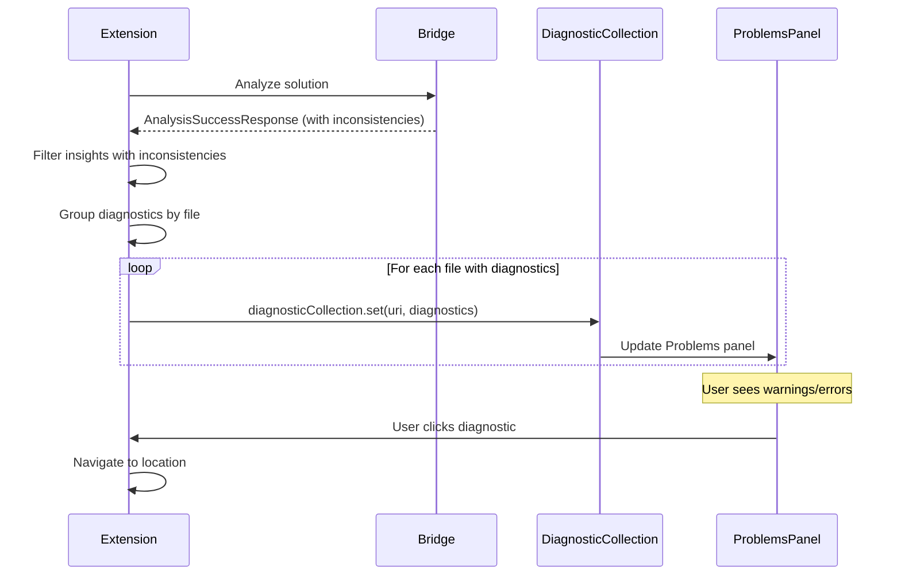

# Contract: Problems Provider (Diagnostics)

**Feature**: VS Code Logging Insights Extension
**Component**: Problems Panel Integration
**Purpose**: Define how logging inconsistencies are published to VS Code Problems panel

---

## Diagnostic Collection Management

### Initialization

**When**: Extension activates

**Process**:
```typescript
const diagnosticCollection = vscode.languages.createDiagnosticCollection('loggerUsage');
context.subscriptions.push(diagnosticCollection);
```

**Properties**:
- **Collection name**: `loggerUsage`
- **Lifecycle**: Tied to extension activation context
- **Scope**: Workspace-wide (not per-file)

---

### Publishing Diagnostics

**When**: Analysis completes (full or incremental)

**Process**:
1. Extension receives `AnalysisSuccessResponse` from bridge
2. Filters insights where `hasInconsistencies: true`
3. For each inconsistency, creates `vscode.Diagnostic` object
4. Groups diagnostics by file URI
5. Calls `diagnosticCollection.set(uri, diagnostics[])`

**Behavior**:
- Replaces existing diagnostics for each file (not additive)
- Diagnostics appear in Problems panel immediately
- Editor shows squiggly underlines at diagnostic locations
- Hover tooltip shows diagnostic message

---

## Diagnostic Creation

### From Parameter Inconsistency

**Input**: `ParameterInconsistency` from analysis result

**Mapping**:
```typescript
const diagnostic = new vscode.Diagnostic(
  new vscode.Range(
    new vscode.Position(inconsistency.location.startLine - 1, inconsistency.location.startColumn - 1),
    new vscode.Position(inconsistency.location.endLine - 1, inconsistency.location.endColumn - 1)
  ),
  inconsistency.message, // e.g., "Parameter name 'userId' does not match template placeholder '{id}'"
  inconsistency.severity === 'Error'
    ? vscode.DiagnosticSeverity.Error
    : vscode.DiagnosticSeverity.Warning
);

diagnostic.source = 'LoggerUsage';
diagnostic.code = inconsistency.type; // e.g., 'PARAM_INCONSISTENCY'
```

**Diagnostic Properties**:
- **range**: Exact location of inconsistency (1-indexed in model, 0-indexed in VS Code API)
- **message**: Human-readable description
- **severity**: Warning or Error (based on inconsistency type)
- **source**: Always "LoggerUsage"
- **code**: Inconsistency type identifier (for filtering, documentation links)

---

### From Missing EventId

**Scenario**: Logging statement missing EventId parameter (flagged by analyzer)

**Diagnostic**:
```typescript
{
  range: <invocation range>,
  message: "Logging statement should include an EventId for better traceability",
  severity: Warning,
  source: "LoggerUsage",
  code: "MISSING_EVENT_ID"
}
```

---

### From Sensitive Data Classification

**Scenario**: Parameter tagged with `[DataClassification]` attribute indicating sensitive data

**Diagnostic**:
```typescript
{
  range: <parameter range>,
  message: "Potentially sensitive data (PersonalData) logged: parameter 'email'",
  severity: Warning,
  source: "LoggerUsage",
  code: "SENSITIVE_DATA_IN_LOG",
  relatedInformation: [
    {
      location: <attribute location>,
      message: "Data classification defined here"
    }
  ]
}
```

---

## Diagnostic Codes

| Code | Severity | Description |
|------|----------|-------------|
| `PARAM_INCONSISTENCY` | Warning | Parameter name doesn't match template placeholder |
| `MISSING_EVENT_ID` | Warning | Logging call missing EventId |
| `SENSITIVE_DATA_IN_LOG` | Warning | Potentially sensitive data in log parameters |
| `DUPLICATE_EVENT_ID` | Error | EventId used in multiple distinct log statements |
| `INVALID_TEMPLATE` | Error | Message template has syntax errors |

---

## Clearing Diagnostics

### On File Save (Incremental Analysis)

**Behavior**:
- Clear diagnostics for saved file: `diagnosticCollection.delete(uri)`
- Re-analyze file
- Publish new diagnostics for that file only
- Other files' diagnostics unchanged

---

### On Solution Change

**Behavior**:
- Clear all diagnostics: `diagnosticCollection.clear()`
- Trigger full re-analysis
- Publish new diagnostics for all files

---

### On Configuration Change

**Scenario**: User disables `enableProblemsIntegration` setting

**Behavior**:
- Clear all diagnostics: `diagnosticCollection.clear()`
- Stop publishing new diagnostics until re-enabled
- Analysis still runs, but results not shown in Problems panel

---

## Configuration Integration

### `enableProblemsIntegration`

**Type**: `boolean` (default: `true`)

**Behavior**:
- `true`: Publish diagnostics to Problems panel
- `false`: Skip diagnostic creation, no Problems panel entries

**Hot-reload**: Change takes effect immediately (no extension reload required)

---

### Filter by Diagnostic Code (Future Enhancement)

**Proposed Config**: `loggerUsage.diagnostics.ignoredCodes`

**Example**:
```json
{
  "loggerUsage.diagnostics.ignoredCodes": ["MISSING_EVENT_ID"]
}
```

**Behavior**: Diagnostics with specified codes not published

---

## Performance Considerations

### Batching

**Rule**: Update diagnostics per-file, not per-diagnostic

**Rationale**: VS Code API is optimized for bulk updates per file

**Implementation**:
```typescript
// Group diagnostics by file
const diagnosticsByFile = new Map<string, vscode.Diagnostic[]>();

for (const insight of insights) {
  if (!insight.hasInconsistencies) continue;

  const uri = vscode.Uri.file(insight.location.filePath);
  if (!diagnosticsByFile.has(uri.toString())) {
    diagnosticsByFile.set(uri.toString(), []);
  }

  diagnosticsByFile.get(uri.toString())!.push(...createDiagnostics(insight));
}

// Publish in batch
for (const [uriString, diagnostics] of diagnosticsByFile) {
  diagnosticCollection.set(vscode.Uri.parse(uriString), diagnostics);
}
```

---

### Large Solutions

**Scenario**: 1000+ files with inconsistencies

**Behavior**:
- Publish diagnostics incrementally (e.g., 100 files at a time)
- Show progress notification: "Publishing diagnostics: 300/1000"
- Avoid blocking UI thread

---

## Related Information

### Linking Related Diagnostics

**Scenario**: Parameter inconsistency where same EventId used in multiple places

**Diagnostic**:
```typescript
const diagnostic = new vscode.Diagnostic(/* ... */);
diagnostic.relatedInformation = [
  new vscode.DiagnosticRelatedInformation(
    new vscode.Location(
      vscode.Uri.file('OtherFile.cs'),
      new vscode.Range(/* other occurrence */)
    ),
    "Same EventId used here"
  )
];
```

**User Experience**:
- Primary diagnostic shown in Problems panel
- Related information links to other occurrences
- Clicking link navigates to related location

---

## Quick Fixes (Code Actions)

### Future Enhancement: Auto-Fix Inconsistencies

**Trigger**: User clicks lightbulb 💡 on diagnostic

**Quick Fix Options**:
1. **Rename parameter to match template**:
   - Diagnostic: `Parameter 'user' doesn't match template placeholder '{userId}'`
   - Quick fix: Rename parameter to `userId`
   - Uses VS Code rename refactoring API

2. **Update template to match parameter**:
   - Quick fix: Change template `{userId}` to `{user}`
   - Edits message template string

3. **Add EventId**:
   - Diagnostic: `MISSING_EVENT_ID`
   - Quick fix: Insert `new EventId(1001)` parameter
   - Prompts user for EventId value

**Implementation**:
```typescript
class LoggerUsageCodeActionProvider implements vscode.CodeActionProvider {
  provideCodeActions(document, range, context, token) {
    const diagnostics = context.diagnostics.filter(d => d.source === 'LoggerUsage');
    const actions: vscode.CodeAction[] = [];

    for (const diagnostic of diagnostics) {
      if (diagnostic.code === 'PARAM_INCONSISTENCY') {
        actions.push(this.createRenameParameterAction(diagnostic));
        actions.push(this.createUpdateTemplateAction(diagnostic));
      }
      // ... other quick fixes
    }

    return actions;
  }
}
```

---

## Testing Scenarios

### Basic Publishing

1. Analyze solution with inconsistencies → diagnostics appear in Problems panel
2. Click diagnostic → editor navigates to location
3. Hover over squiggly → tooltip shows diagnostic message

### Incremental Update

1. Save file with fix → old diagnostic cleared, new diagnostic published (if still exists)
2. Fix inconsistency, save → diagnostic disappears from Problems panel

### Configuration

1. Disable `enableProblemsIntegration` → diagnostics cleared from panel
2. Re-enable → diagnostics reappear after next analysis

### Performance

1. Analyze solution with 500 inconsistencies → diagnostics publish within 2 seconds
2. Problems panel remains responsive during bulk updates

### Related Information

1. Diagnostic with related info → click related link → navigates to other file

---

## Sequence Diagram: Diagnostic Publishing



---

## Accessibility

- **Screen reader**: Diagnostics announced as "Warning: Parameter name inconsistency..."
- **Keyboard navigation**: Tab through diagnostics in Problems panel, Enter to navigate
- **Severity icons**: Clear visual distinction (⚠️ Warning, ❌ Error)

---

## Error Handling

### Invalid Location

**Scenario**: Diagnostic location out of bounds (e.g., line > file length)

**Behavior**:
- Log warning: "Invalid diagnostic location for file X:Y:Z"
- Skip that diagnostic, publish others
- Show notification: "Some diagnostics could not be published. Check log."

### Diagnostic Creation Failure

**Scenario**: Exception during `new vscode.Diagnostic()`

**Behavior**:
- Catch exception, log error
- Continue with next diagnostic
- Partial diagnostics published

---

**Contract Owner**: `ProblemsProvider` (TypeScript)
**Dependencies**: VS Code Diagnostic API, Analysis Service, Configuration
**Validation**: Unit tests with mock diagnostic collection, integration tests with real files
